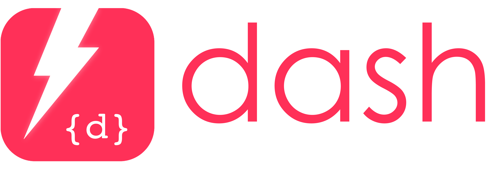

# dash &middot;  

    

Dash is a .NET Core command-line tool for fast model-driven code generation.

Dash promotes a model-driven approach to software development, allowing you to write concise model specifications
defining domain entities and its relationship with eachother using JSON.

## Installing Dash
The following command installs the latest version of Dash:
~~~ cmd
dotnet tool install --global dotnet-dash --version 0.1.0-alpha
~~~

The following command updates Dash to the latest version:
~~~ cmd
dotnet tool update --global dotnet-dash --version 0.1.0-alpha
~~~

## Hello World example
To generate code, you need to write a *Model* file.

Consider the following `helloworld.json` Model file, where we define **one** _Entity_ `Account` with **two** _Attributes_:
~~~ JSON
{
    "Model": {
        "Account": {
            "Username": "String",
            "PasswordHash": "String"
        }
    }
}
~~~

To generate code for your `.csproj`, you simply run the following CLI command:
~~~ cmd
dotnet dash --file helloworld.json
~~~

If you have added a [`.editorconfig`](https://docs.microsoft.com/en-us/visualstudio/ide/create-portable-custom-editor-options?view=vs-2019) file to your poject, the generated code will be formatted accordingly.

The result is the following POCO class:
~~~ csharp
public class Account
{
    public string Username { get; set; }
    public string PasswordHash { get; set; }
}
~~~

and EF Context class:
~~~ csharp
public class HelloWorldDbContext : DbContext
{
    public ICollection<Account> Accounts { get; set; }
}
~~~

## Advanced examples
Here are some more advanced and practical Model file examples that showcases the power of Dash:

- [Currency and Country](./docs/currency-and-country): this example showcases the use of [Relationships](./docs/relationships), and providing your Entities with [Seed Data](./docs/seed-data) from a CSV file.
- [IdentityServer4](./docs/samples/identityserver4): here, we use Dash to recreate parts of the wonderful [IdentityServer4](https://github.com/IdentityServer/IdentityServer4) open source project.

### How does the Model file look like?

At this point, it would be more interesting to see how the Model file looks like.

So let us start with a _simple_ yet **practical example** to showcase the power of Dash.

In the following example, we:
- define an [Entity](./docs/entity.md) called `Currency` with 3 [Attributes](./docs/entity.md#attributes):
    - `Code` of the type [string](./docs/datatypes#string) with a maximum of length of 3.
    - `Name` of the type [unicode](./docs/datatypes#unicode) indicating that it is a string that also supports unicode characters.
    - `NumericCode` of the type [integer](./docs/datatypes#integer)
- use the [special @@Seed property](./docs/seed.md) to specify that `Currency` has seed data, and that this data exists inside a CSV file located in a GitHub repository.
- specify how the CSV data is mapped to each attribute using the `MapHeaders` property.

Here's how our `mymodel.json` Model file looks like:
~~~ JSON
{
    "Model": {
        "Currency": {
            "Code": "String[3]",
            "Name": "Unicode",
            "NumericCode": "Int",

            "@@Seed": {
                "FromCsv": {
                    "Uri": "https://raw.githubusercontent.com/datasets/currency-codes/master/data/codes-all.csv",
                    "FirstLineIsHeader": true,
                    "MapHeaders": {
                        "Currency": "Name",
                        "AlphabeticCode": "Code",
                        "NumericCode": "NumericCode"
                    }
                }
            }
        }
    }
}
~~~

When we run the Dash CLI command to generate code, it will (by default) generate:
- an [EF Poco](./docs/templates#ef-poco) class for `Currency`
- an [EF Context](./docs/templates#ef-context) database context class with the seed data

To configure the generation output, we need to add a `Configuration` Object to our Model file:
~~~ JSON
{
    "Configuration": {
        "Templates": [
            {
                "TemplateName": "dash://efpoco"
            },
            {
                "TemplateName": "dash://efcontext"
            },
            {
                "TemplateName": "file://c:/mytemplates/controllers.dt"
            }
        ]
    },

    "Model": {
        /* the above model */
    }
}
~~~

As you can see in the above example, we use the `dash://` scheme to indicate that it should use the built-in templates to generate code. However, you can also write your own custom templates, which can then be referenced using `file://` or `https://`.

## More reading material
This was just a very short introduction to Dash.

To get a more complete overview of all the features of Dash, please check out the [Documentation](./docs/readme.md).

## Code status

