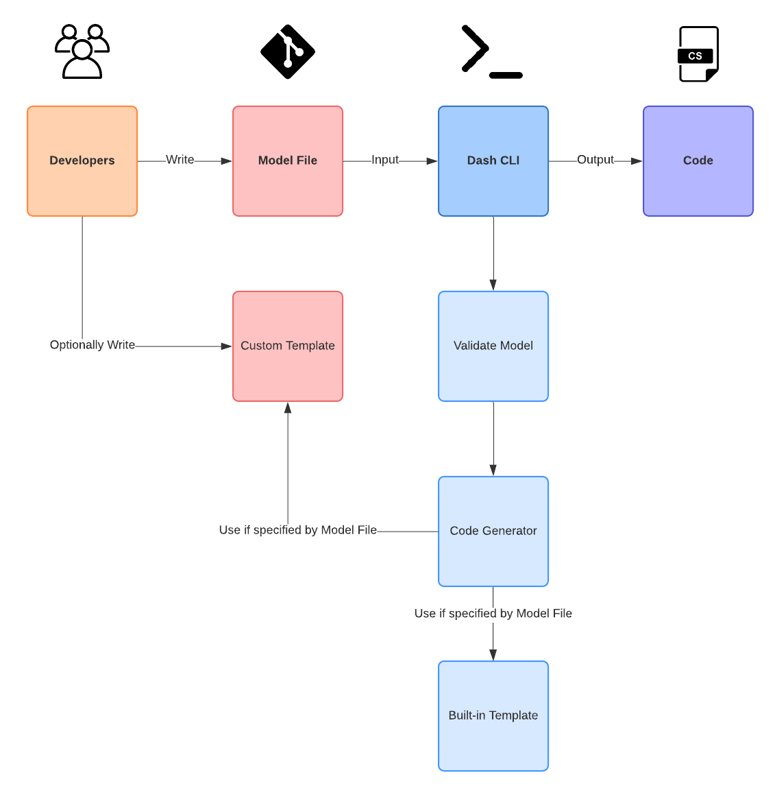

    

Dash is a .NET command-line tool for fast model-driven code generation.

## How Dash Works
- As a Developer, you will be writing a [Model File](/user-guide/model-file.md) using JSON to describe Domain Entities and its relationship with eachother.
- Dash has several generic [Built-in Templates]() to generate code based on your Model File.
- You can also write [Custom Templates](/user-guide/custom-templates) to generate code to cover more specific use cases.
- Run the [Dash CLI](/user-guide/dash-cli) tool to generate the code.

Here is a visual representation of the above:

## Installation
Installation is pretty simple, just copy and paste the following command:

~~~
dotnet tool install --global dotnet-dash --version 0.2.1-alpha
~~~

If you have successfully installed Dash, the following command will bring up the help screen:

~~~
dotnet dash --help
~~~

## Update
Updating to the latest, or different, version of Dash is equally simple:

~~~
dotnet tool update --global dotnet-dash --version 0.2.1-alpha
~~~

## Hello World example
To generate code, you need to write a *Model File*.

Consider the following `helloworld.json` Model File, where we define **one** _Entity_ `Account` with **two** _Attributes_:
~~~ JSON
{
    "Model": {
        "Account": {
            "Username": "String",
            "PasswordHash": "String"
        }
    }
}
~~~

To generate code for your `.csproj`, you simply run the following CLI command:
~~~ cmd
dotnet dash --file helloworld.json
~~~

If you have added a [`.editorconfig`](https://docs.microsoft.com/en-us/visualstudio/ide/create-portable-custom-editor-options?view=vs-2019) file to your poject, the generated code will be formatted accordingly.

The result is the following POCO class:
~~~ csharp
public class Account
{
    public int Id { get; set; }
    public string Username { get; set; }
    public string PasswordHash { get; set; }
}
~~~

As you can see, even though the `Id` attribute was not explicitly declared, Dash will implicitly add the attribute to the Model.

EF Context class:
~~~ csharp
public class HelloWorldDbContext : DbContext
{
    public ICollection<Account> Accounts { get; set; }
}
~~~